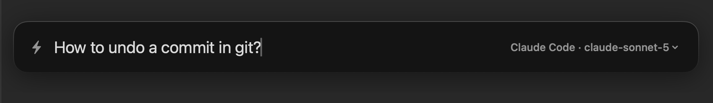

# QuickAI

A tiny, keyboard-driven AI panel for macOS. Press a hotkey, ask, read the answer at full width, keep asking.

Built as a free replacement for Raycast Quick AI after it moved behind Raycast Pro.



## Why

Native Swift (SwiftUI + AppKit), no Electron, no account, no telemetry. It lives in the menu bar and shows a Spotlight-style floating panel over whatever you are doing. You bring the model: an OpenRouter key (the free tier works), your own OpenAI-compatible server, or a coding-agent CLI you are already logged into (Claude Code, OpenCode, GitHub Copilot).

## Features

- **One hotkey, one Enter.** ⌥Space opens a compact input. Enter streams the answer into a full-width panel with real Markdown: tables, code blocks, lists. Follow-ups go in the same thread.
- **Your models, your keys.** OpenRouter (including `openrouter/free`, a zero-cost router over free models) or any OpenAI-compatible local server (llama.cpp, llama-swap, LM Studio, Ollama). Star the models you actually use and switch with ⌘P.
- **Or no key at all.** If Claude Code, OpenCode or the GitHub Copilot CLI is installed and logged in, QuickAI can answer through it, so the panel runs on the subscription you already pay for. It calls the CLI you have, with its tools and customizations off by default: a plain answerer, not an agent loose on your machine.
- **Everything is a keystroke.** New chat, copy answer, retry, previous conversation, history, settings. The mouse is optional.
- **History that finds things.** Conversations are saved locally and searched with a port of fzf's matching algorithm, highlights included. Deletes go to a bin for 30 days.
- **Yours to keep.** Prompts go straight to the provider you configured, nowhere else. No sign-up, no cloud sync, no analytics.

## Install

Download the latest `.dmg` from [Releases](https://github.com/saaguero/quickai/releases), drag QuickAI to Applications, and launch it. Requires macOS 13 or later; the app is universal (Apple Silicon and Intel).

The build is not signed with an Apple Developer ID yet, so the first launch is blocked by Gatekeeper. Open System Settings > Privacy & Security and click "Open Anyway", or run `xattr -dr com.apple.quarantine /Applications/QuickAI.app` once.

Or build it yourself, which needs only the Xcode Command Line Tools (`xcode-select --install`):

```sh
git clone https://github.com/saaguero/quickai.git
cd quickai
./scripts/bundle.sh
ditto build/QuickAI.app /Applications/QuickAI.app
open /Applications/QuickAI.app
```

Then open Settings (⌘, in the panel, or the bolt icon in the menu bar), paste your OpenRouter API key, and star a few models. Add QuickAI to your Login Items if you want it always around.

## Shortcuts

| Key | |
|---|---|
| ⌥Space | show / hide the panel (configurable) |
| ⏎ / ⎋ | send / stop, back, close |
| ⌘N | new chat |
| ⌘P | switch model |
| ⌘R | retry the last answer |
| ⌘Y | history (fuzzy search, ⏎ resumes) |
| ⌘[ / ⌘] | older / newer conversation |
| ⌘⇧C / ⌘⇧A | copy the answer / the whole conversation |
| ⌘/ | every shortcut, in the panel |

## Development

```sh
swift build          # compile
./scripts/bundle.sh  # release build + .app bundle in build/
```

Running the bare binary (`swift run`) is not equivalent to the bundle: without the Info.plist there is no App Transport Security exemption for plain-http local servers, no menu-bar-only mode, and UserDefaults land in a different domain. Test with the bundled app.

## License

MIT, see [LICENSE](LICENSE).
